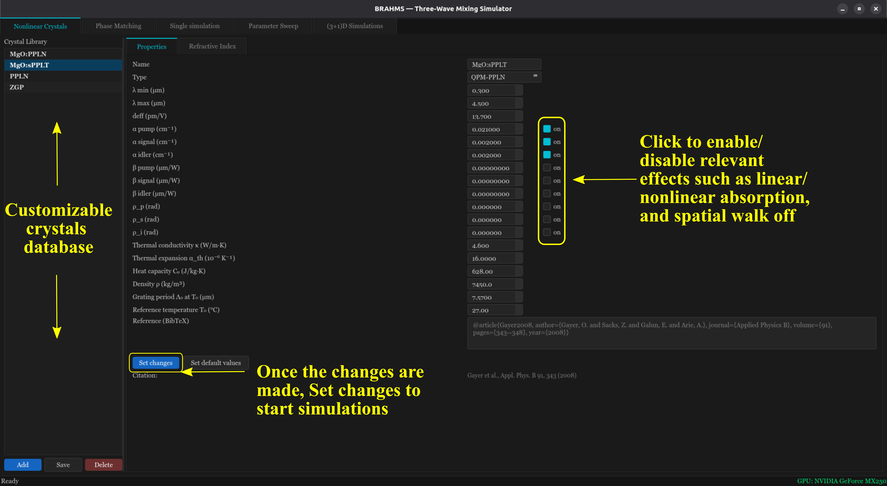
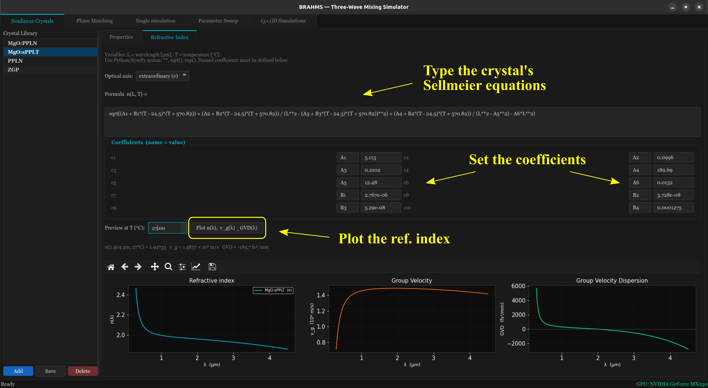
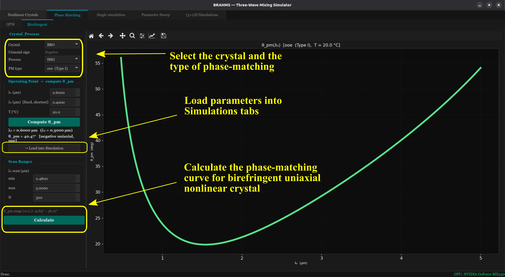
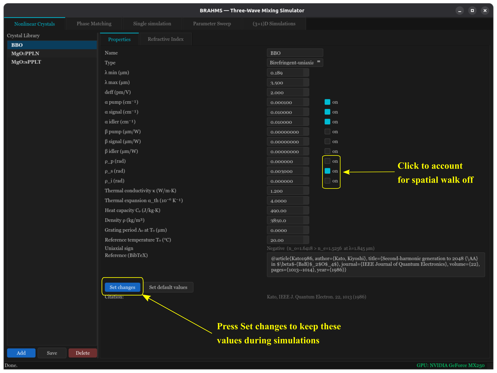
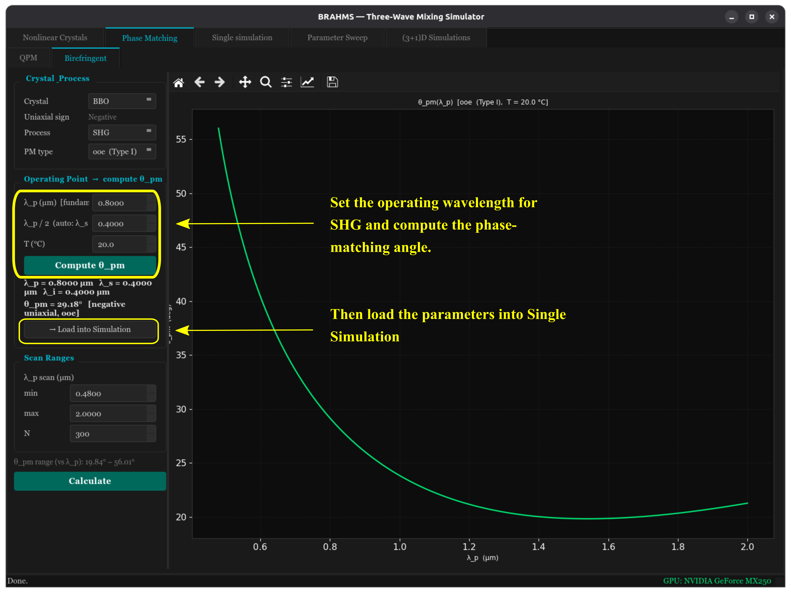
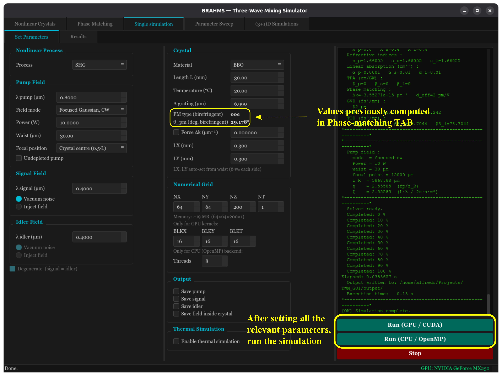
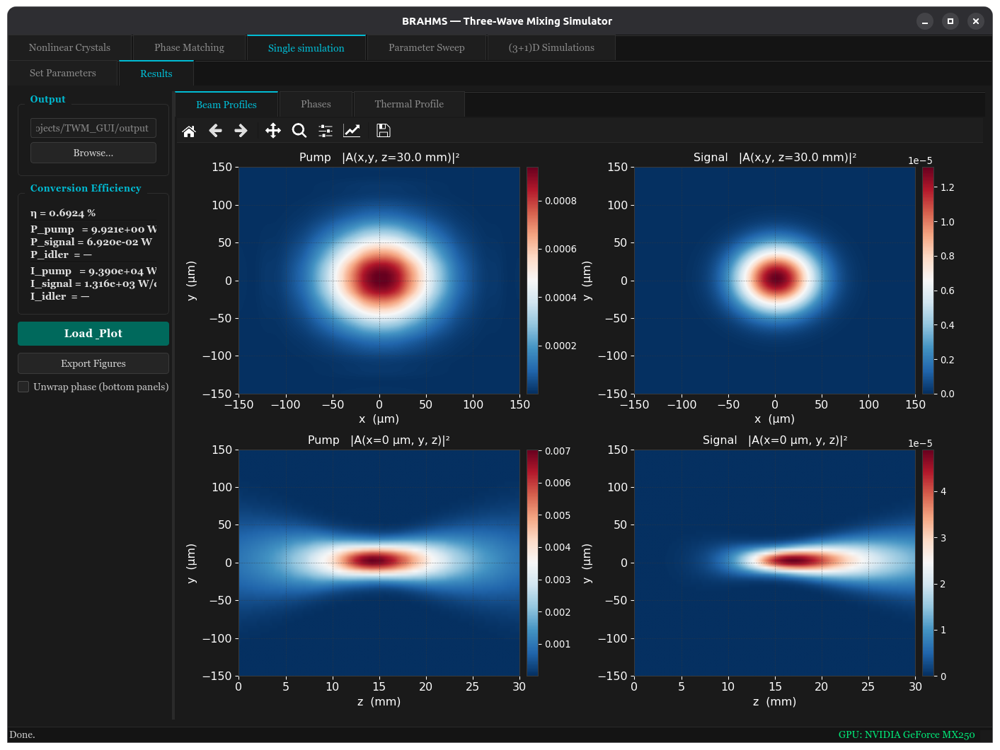
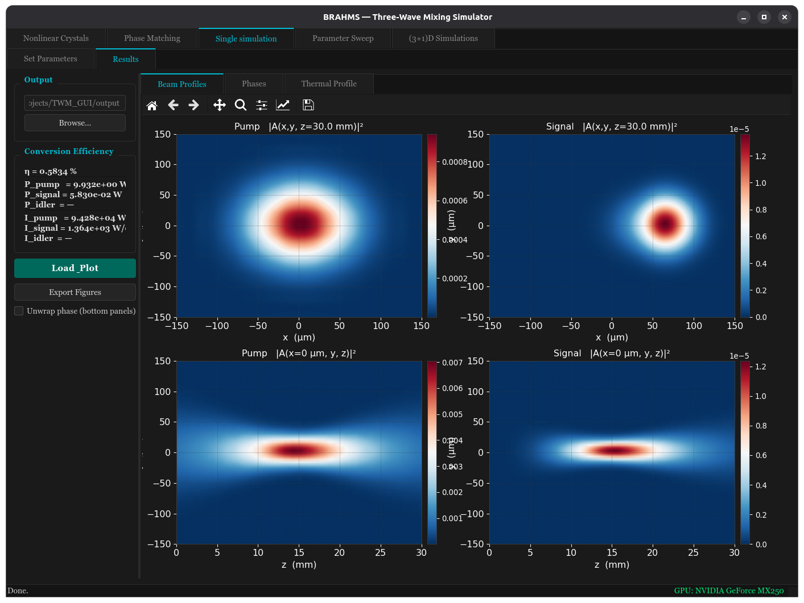

# Examples

BRAHMS is used entirely through its graphical interface — there are no
Python scripts to edit. This page walks through a typical session, tab by
tab.

## 1. Nonlinear Crystals

Define the crystal you want to simulate directly from its Sellmeier
equation(s), specifying whether it is quasi-phase-matched (QPM) or
birefringent, together with its relevant parameters ($d_\mathrm{eff}$,
linear and two-photon absorption, walk-off angle, thermal properties,
grating period for QPM crystals, etc.). Common crystals (e.g., MgO:PPLN,
MgO:sPPLT, BBO) are pre-loaded with literature Sellmeier
coefficients; you can add, edit, or remove custom crystals here.

**Properties.** The crystal library on the left is fully customizable —
add, edit, save, or delete entries. For the selected crystal, set its
physical properties (absorption, two-photon absorption, thermal
conductivity, grating period, etc.), and use the checkboxes to enable or
disable specific effects (linear/nonlinear absorption, spatial walk-off)
for the simulation. Click **Set changes** after editing to apply them
before running a simulation.

**Refractive Index.** Type the crystal's Sellmeier equation(s) using
standard Python/SymPy syntax, set the named coefficients, and preview the
resulting refractive index $n(\lambda)$, group velocity $v_g(\lambda)$,
and group-velocity dispersion GVD($\lambda$) at a given temperature.

## 2. Phase Matching

Given the selected crystal and a set of experimental parameters, this tab
computes the phase-matching condition for the three-wave-mixing process you
want to study (SHG, SFG, DFG, or OPG). It is split into two sub-tabs
matching the crystal's phase-matching mechanism: **QPM**, for
periodically-poled crystals, shows $\lambda_s,\lambda_i$ vs. temperature and
grating period; **Birefringent**, for uniaxial crystals, shows the
phase-matching angle $\theta_\mathrm{pm}$ vs. wavelength for the selected PM
type (e.g., ooe, eoe), and lets you send the operating point (crystal,
wavelengths, PM type, angle) directly to the Simulation tabs.

## 3. Single simulation

Runs one (3+1)D or reduced-dimensionality simulation for a given
configuration, on either the CPU or GPU backend. Use this tab to explore a
single set of physical parameters and inspect the resulting beam profiles,
phases, and (optionally) thermal profile.

### Walkthrough: SHG in birefringent β-BBO

This example runs SHG (0.8 → 0.4 μm) in β-BBO, a birefringent crystal, and
compares the result with and without spatial walk-off.

**1. Enable spatial walk-off for the signal.** In **Nonlinear Crystals →
Properties**, check the "on" box next to $\rho_s$ (rad) to include the
signal's spatial walk-off angle in the simulation, or leave it unchecked to
ignore it. As with any property edit, click **Set changes** afterwards —
otherwise the change has no effect on the next run.

**2. Compute the phase-matching angle.** In **Phase Matching → Birefringent**,
set the operating (fundamental) wavelength for SHG and click **Compute
θ_pm**, then **→ Load into Simulation** to send the crystal, wavelengths, PM
type, and $\theta_\mathrm{pm}$ to the Single simulation tab.

**3. Set the remaining parameters and run.** Back in **Single simulation**,
confirm that the PM type and $\theta_\mathrm{pm}$ were loaded correctly, set
any other parameters (power, waist, crystal length, grid, etc.), and press
**Run (GPU/CUDA)** or **Run (CPU/OpenMP)**. The Results sub-tab opens
automatically once the run finishes.

**4–5. Compare with and without walk-off.** Without spatial walk-off, pump
and signal stay collinear along the crystal. With it enabled (step 1), the
signal beam visibly drifts transversally away from the pump as it
propagates — the walk-off displacement.

## 4. Parameter Sweep

Automates repeated simulations while scanning one physical parameter
(e.g., pump power, beam waist, crystal temperature, or phase mismatch) to
compute conversion-efficiency curves and identify optimal operating
conditions.

## 5. (3+1)D Simulations

Runs the full space- and time-resolved simulation in `focused-pulsed`
mode — the most demanding configuration BRAHMS supports, and the one that
benefits the most from the GPU backend.

---

For the underlying physical model and numerical method, see the paper (in
preparation) or the [README](./README.md#package-description).
