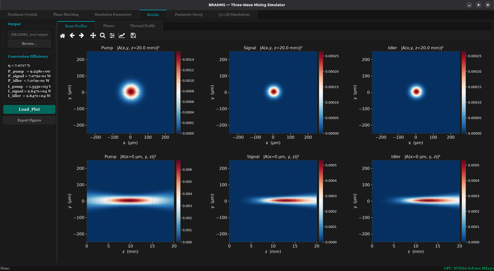

# BRAHMS — Three-Wave Mixing Simulator

A cross-platform GUI for simulating three-wave mixing processes (SHG, SFG, OPG, DFG) in nonlinear crystals, with both a GPU (CUDA) and a CPU (OpenMP) simulation engine. BRAHMS was originally designed to run on GPU — that is the recommended engine for production runs — and the CPU/OpenMP engine was added afterwards so the app also runs on machines without an NVIDIA GPU. The app allows you to load your own nonlinear crystals and use them to simulate three-wave mixing processes, including the effects of linear and nonlinear absorption, dispersion, and diffraction, considering both pulsed and continuous-wave (cw) regimes.



## Package Description

**BRAHMS** is a GPU-accelerated toolkit that simulates the coupled wave equations (CWEs) describing three-wave mixing (TWM) processes in second-order nonlinear media. The physics solved in the package is written to be as general as possible, including diffraction and dispersion effects within a single simulation. This means that the model is based on a (3+1)D physical problem (three spatial dimensions and one temporal dimension). The model incorporates terms for diffraction, dispersion, and linear and nonlinear absorptions.

With this package, users can:
- Calculate the (3+1)D-electric fields involved, $A_{\lambda} = A_{\lambda}(x,y,z,t)$,
  in Sum Frequency Generation (SFG) (keep in mind that second harmonic
  generation (SHG) is a particular case of SFG) and optical parametric
  generation (OPG) processes.

$$ \frac{\partial A_{p}}{\partial z} = i\kappa_p A_{s} A_{i}e^{\mp i\Delta k z} + \left(\hat{\mathcal{D}}^{(\tau)}_{p}+\hat{\mathcal{D}}^{(xy)}_{p} - \frac{\alpha_p}{2} \right)A_{p} $$
$$ \frac{\partial A_{s}}{\partial z} = i\kappa_s A_{p} A_{i}^*e^{\pm i\Delta k z} + \left(\hat{\mathcal{D}}^{(\tau)}_{s}+\hat{\mathcal{D}}^{(xy)}_{s} - \frac{\alpha_s}{2} \right)A_{s} $$
$$ \frac{\partial A_{i}}{\partial z} = i\kappa_i A_{p} A_{s}^*e^{\pm i\Delta k z} + \left(\hat{\mathcal{D}}^{(\tau)}_{i}+\hat{\mathcal{D}}^{(xy)}_{i} - \frac{\alpha_i}{2} \right)A_{i}$$

where

$$\hat{\mathcal{D}}^{(\tau)}_{\lambda} = -\left[ \frac{\alpha_{\lambda}}{2}+ \left(\frac{1}{\nu_s} - \frac{1}{\nu_{\lambda}}\right) \frac{\partial}{\partial \tau}+i\frac{k^{''}_{\lambda}}{2}\frac{\partial^2}{\partial \tau^2} + i\frac{k^{'''}_{\lambda}}{3}\frac{\partial^3}{\partial \tau^3} \right]$$

and

$$  \hat{\mathcal{D}}^{(xy)}_{\lambda} = -\frac{i}{2k_{\lambda}}\left(\frac{\partial^2}{\partial x^2}+\frac{\partial^2}{\partial y^2}\right) - \tan{\rho_{\lambda}}\frac{\partial}{\partial x} $$

- Simulate both continuous-wave (cw) and pulsed pumping, using either
  focused Gaussian or plane-wave beams.
- For pulsed cases (femtosecond and picosecond regimes), the package
  efficiently simulates the simultaneous effects of dispersion and
  diffraction ((3+1)D problem).

---

## Requirements

- Python 3.10+
- Linux: a C++ compiler (g++), FFTW3, HDF5, nlohmann/json — installed
  automatically by `install/setup_linux.sh`.
- Recommended: an NVIDIA GPU + CUDA Toolkit, to build and use the GPU engine (the one BRAHMS was originally designed for). Without a GPU, the app falls back to the CPU/OpenMP engine.

## Install

### Linux (Ubuntu/Debian)

```bash
git clone https://github.com/alfredos84/BRAHMS.git
cd BRAHMS
bash install/setup_linux.sh
```

This installs system dependencies, creates a Python virtual environment,
builds the CPU simulation engine (and the GPU engine too, if an NVIDIA GPU
+ CUDA toolkit is detected), and adds a **BRAHMS** launcher to your
applications menu and Desktop — just double-click it to open the app.

To launch it manually instead:

```bash
bash install/run_brahms.sh
```

### Windows

Prerequisites: [Python 3](https://www.python.org/downloads/) (check "Add
python.exe to PATH" during install) and
[Git for Windows](https://git-scm.com/download/win).

```cmd
git clone https://github.com/alfredos84/BRAHMS.git
cd BRAHMS
powershell -ExecutionPolicy Bypass -File install\setup_windows.ps1
```

`-ExecutionPolicy Bypass` only skips Windows' default block on running
downloaded `.ps1` scripts for this one invocation — it does not change any
system-wide setting, and no admin rights are needed.

This creates a Python virtual environment and a **BRAHMS** shortcut on your
Desktop and Start Menu — the GUI itself is ready to use at this point. To
also *run simulations* you additionally need a C++ compiler, which Windows
does not ship by default:

**CPU engine (engine_omp) — works on any machine:**

1. Install [MSYS2](https://www.msys2.org/) (default folder `C:\msys64`).
2. Open **"MSYS2 MinGW x64"** from the Start Menu (not "MSYS2 MSYS" or
   "UCRT64").
3. Run `pacman -Syu`. If it asks you to close the terminal, reopen "MSYS2
   MinGW x64" and run `pacman -Syu` again — repeat until it reports nothing
   left to update. (MSYS2 does not support partial upgrades; skipping this
   causes a dependency-conflict error on the next step.)
4. Install the toolchain:
   ```bash
   pacman -S mingw-w64-x86_64-gcc mingw-w64-x86_64-make mingw-w64-x86_64-fftw mingw-w64-x86_64-hdf5 mingw-w64-x86_64-nlohmann-json
   ```
5. Add `C:\msys64\mingw64\bin` to your PATH (search "Environment Variables"
   in the Start Menu → Edit the `Path` user variable → New).
6. Open a **new** `cmd` window and confirm `g++ --version` and
   `mingw32-make --version` both print a version.

**GPU engine (engine_gpu) — optional, needs an NVIDIA GPU:** install the
[CUDA Toolkit](https://developer.nvidia.com/cuda-downloads) and Visual
Studio Build Tools (the "Desktop development with C++" workload, for
`cl.exe`), then build from an "x64 Native Tools Command Prompt". This path
is less exercised on Windows than the CPU engine above.

**Alternative:** skip the compiler setup entirely by installing
[WSL](https://learn.microsoft.com/windows/wsl/install) (`wsl --install`,
needs admin rights) and running `install/setup_linux.sh` inside it.

## Manual run (any platform, if you prefer not to use the installers)

```bash
python3 -m venv venv
source venv/bin/activate        # venv\Scripts\activate on Windows
pip install -r requirements.txt
python main.py
```

## Repository layout

```
gui/            PyQt6 application (tabs, widgets, config builder)
engine_omp/     CPU simulation engine (C++/OpenMP)
engine_gpu/     GPU simulation engine (C++/CUDA)
crystals/       Nonlinear-crystal database (SQLite, created on first run)
icon/           App icon (icon.png / icon.ico)
install/        Installers and desktop launchers
main.py         Entry point
```
